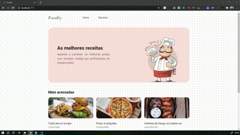

[coment]: # (Inserir logo do projeto no campo abaixo)

<p align=center>
    <!--img src="" alt="logo">
    
</p>

# 😋 FoodFy

<p align=right>🚧 Sistema em construção 🚧</p>

## 🚀 Sobre o Desafio
<p align=justify>
O FoodFy está sendo desenvolvido como desafio final para o bootcamp LaunchBase, da <a href="https://rocketseat.com.br">Rocketseat</a> e consiste em um site completo de receitas. 
</p>



### ✔ Etapas do desafio

1. <b>[x] Construindo o FoodFy:</b> Início da estrutura HTML / CSS projeto

2. <b>[x] Refatorando o FoodFy:</b> Refatoração do código,  estruturação do back-end, converção do projeto para Node.js utilizando Nunjucks e utilização de um arquivo com os dados da receitas, tornando o site ainda mais dinâmico

3. <b>[] Admin FoodFy:</b> Criação da área administratriva, rotas administrativas, detalhes da receita, campo dinâmico para insersão de ingredientes e modo de preparo

4. <b>[] Persistindo Dados do FoodFy</b>

5. <b>[] Upload de Imagens</b>

6. <b>[] Apresentação e Organização das receitas no FoodFy</b> 

7. <b>[] Sistema de Login FoodFy</b>

8. <b>[] Conceitos Avançados</b>

[coment]: # (➕ Funcionalidades adicionais)

[coment]: # (Para que o sistema fosse executado de forma ainda mais inteligente, foram inseridas algumas funcionalidades.)

## 👩🏽‍💻 Instruções para execução

<p align=justify>
</p>

```bash
$ npm install

$ npm start
```


## 📄 Licença
<p align=justify>
    Esse projeto foi desenvolvido sob a licença MIT. Para ver mais detalhes da licença, acesse <a href="LICENSE">LICENSE</a>.
</p>